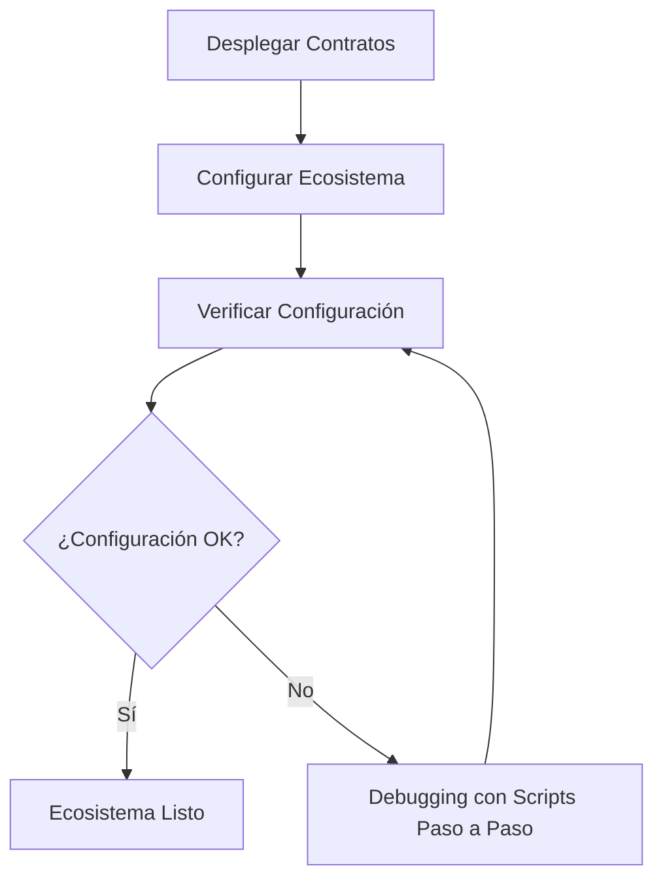

# Scripts de Configuración del Ecosistema UnitPoints

Este directorio contiene scripts para configurar el ecosistema UnitPoints después del despliegue de los contratos. Los scripts configuran permisos, direcciones entre contratos y registran tokens de sector.

## 📋 Prerrequisitos

1. **Contratos desplegados**: Todos los contratos deben estar desplegados usando los módulos de Hardhat Ignition
2. **Permisos de admin**: El deployer debe tener permisos de admin en todos los contratos
3. **Red configurada**: La red debe estar configurada en `hardhat.config.ts`

## 🚀 Scripts Disponibles

### 1. `configure-ecosystem.ts` - Configuración Manual

Script básico que requiere actualizar las direcciones de contratos manualmente.

**Uso:**

```bash
# 1. Editar el script y actualizar las direcciones en CONTRACT_ADDRESSES
# 2. Ejecutar el script
npx hardhat run scripts/configure-ecosystem.ts --network <network>
```

**Ventajas:**

- Control total sobre las direcciones
- Fácil de entender y modificar
- No depende de archivos de deployment

**Desventajas:**

- Requiere actualización manual de direcciones
- Propenso a errores de copia/pega

### 2. `configure-ecosystem-auto.ts` - Configuración Automática

Script que lee automáticamente las direcciones de los contratos desplegados.

**Uso:**

```bash
npx hardhat run scripts/configure-ecosystem-auto.ts --network <network>
```

**Ventajas:**

- No requiere actualización manual de direcciones
- Lee automáticamente desde archivos de deployment
- Menos propenso a errores

**Desventajas:**

- Depende de la estructura de archivos de deployment
- Puede fallar si los archivos no están en la ubicación esperada

### 3. `configure-ecosystem-step-by-step.ts` - Configuración Paso a Paso

Script que permite ejecutar cada paso de configuración por separado.

**Uso:**

```bash
# 1. Editar el script y actualizar las direcciones en CONTRACT_ADDRESSES
# 2. Configurar qué pasos ejecutar en STEPS_TO_RUN
# 3. Ejecutar el script
npx hardhat run scripts/configure-ecosystem-step-by-step.ts --network <network>
```

**Ventajas:**

- Control granular sobre qué pasos ejecutar
- Útil para debugging
- Permite ejecutar pasos individuales
- Incluye verificación de configuración

**Desventajas:**

- Requiere actualización manual de direcciones
- Más complejo de usar

### 4. `verify-ecosystem-config.ts` - Verificación de Configuración

Script para verificar el estado de configuración del ecosistema sin hacer cambios.

**Uso:**

```bash
# 1. Editar el script y actualizar las direcciones en CONTRACT_ADDRESSES
# 2. Ejecutar el script
npx hardhat run scripts/verify-ecosystem-config.ts --network <network>
```

**Ventajas:**

- Solo lectura, no hace cambios
- Verificación completa de permisos y direcciones
- Reporte detallado con estadísticas
- Útil para debugging y validación

**Desventajas:**

- Requiere actualización manual de direcciones
- Solo verifica, no configura

## 🔧 Configuración Requerida

### Permisos (grantAdmin)

Los siguientes permisos se configuran automáticamente:

- `UserManager` → `TokenAdministrator`
- `EventManager` → `TokenAdministrator`
- `CompanyManager` → `EventManager`
- `CompanyManager` → `TokenAdministrator`
- `DAOGovernance` → `EventManager`
- `DAOGovernance` → `TokenAdministrator`
- `UnitPointsTokens` → `TokenAdministrator`

### Direcciones Entre Contratos

Se configuran las siguientes direcciones:

- `EventManager.setDAOGovernance(address)`
- `EventManager.setCompanyManager(address)`
- `TokenAdministrator.setAuxiliaryContracts(eventManager, userManager, daoGovernance)`

### Registro de Tokens

Se registra el token de sector:

- `TokenAdministrator.registerSectorToken(unitpointsTokens)`

## 📝 Estructura de Archivos de Deployment

El script automático busca archivos de deployment en las siguientes ubicaciones:

```
ignition/
├── deployments/
│   ├── chain-31337/          # localhost
│   │   └── deployed_addresses.json
│   └── chain-<chainId>/      # otras redes
│       └── deployed_addresses.json
└── deployments/
    └── <network>/
        └── deployed_addresses.json
```

## 🔍 Verificación de Configuración

### Scripts de Configuración

Todos los scripts de configuración incluyen verificación automática que verifica:

1. **Contratos auxiliares**: Que las direcciones en `TokenAdministrator` sean correctas
2. **Sectores registrados**: Que el token esté registrado correctamente
3. **Direcciones de tokens**: Que la dirección del token de sector sea correcta

### Script de Verificación Dedicado

El script `verify-ecosystem-config.ts` proporciona una verificación completa y detallada:

1. **Permisos**: Verifica todos los permisos `grantAdmin` entre contratos
2. **Direcciones**: Verifica todas las direcciones configuradas entre contratos
3. **Tokens**: Verifica el registro de tokens de sector
4. **Reporte**: Genera estadísticas detalladas (exitosos, fallidos, advertencias)
5. **Solo lectura**: No hace cambios, solo verifica el estado actual

## 🚨 Solución de Problemas

### Error: "No se encontraron archivos de deployment"

- Verificar que los contratos estén desplegados
- Verificar la estructura de directorios de deployment
- Usar el script manual como alternativa

### Error: "Not authorized"

- Verificar que el deployer tenga permisos de admin
- Verificar que las direcciones de contratos sean correctas
- Verificar que la red esté configurada correctamente

### Error: "Invalid address"

- Verificar que las direcciones de contratos sean válidas
- Verificar que no haya espacios o caracteres extra
- Usar `ethers.isAddress()` para validar direcciones

## 📊 Ejemplo de Uso

```bash
# 1. Desplegar contratos
npx hardhat ignition deploy ignition/modules/UnitPointsEcosystemStep1.ts --network sepolia
npx hardhat ignition deploy ignition/modules/UnitPointsEcosystemStep2.ts --network sepolia
npx hardhat ignition deploy ignition/modules/UnitPointsEcosystemStep3.ts --network sepolia
npx hardhat ignition deploy ignition/modules/UnitPointsEcosystemStep4.ts --network sepolia
npx hardhat ignition deploy ignition/modules/UnitPointsEcosystemStep5.ts --network sepolia
npx hardhat ignition deploy ignition/modules/UnitPointsEcosystemStep6.ts --network sepolia

# 2. Configurar ecosistema
npx hardhat run scripts/configure-ecosystem-auto.ts --network sepolia

# 3. Verificar configuración
npx hardhat run scripts/verify-ecosystem-config.ts --network sepolia
```

## 🔄 Flujo de Configuración



## 📞 Soporte

Si encuentras problemas con la configuración:

1. Verificar que todos los contratos estén desplegados
2. Verificar que las direcciones sean correctas
3. Verificar que el deployer tenga permisos de admin
4. Usar el script paso a paso para debugging
5. Revisar los logs de transacciones para errores específicos
